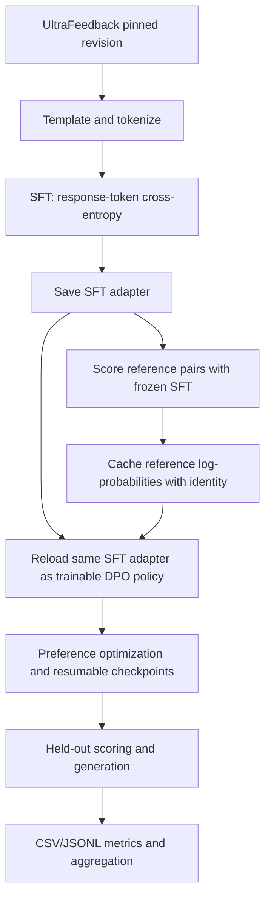

# DPO from scratch: PyTorch implementation and small-scale study

This repository implements supervised fine-tuning (SFT) and Direct Preference Optimization (DPO) with PyTorch and PEFT/LoRA. It explores a practical question: can a small instruction model be preference-tuned, and what can a small, compute-limited evaluation actually tell us? Training uses the project's own PyTorch loops and loss; it does not use TRL's `DPOTrainer`.

## What is implemented

- Chat preference and SFT data loading, template-aware tokenization, response-only scoring masks, padding masks, and EOS handling.
- LoRA SFT and DPO trainers, finite-value checks, periodic checkpoints, and optimizer/scheduler/RNG/cursor resumption.
- An SFT-derived frozen reference policy with precomputed, identity-checked reference log-probabilities.
- Held-out preference scoring, deterministic generation, response-length exports, checkpoint-level evaluation recovery, and result aggregation.
- A simplified train-only data-selection experiment using UltraFeedback's `score_chosen - score_rejected` margin against an equal-size seeded random subset.
- CPU unit tests and a separate Colab workflow for the completed training/evaluation artifacts.

The selection experiment is inspired by [Less is More](https://arxiv.org/abs/2502.14560); it is not a reproduction. It uses dataset-provided score gaps, not the paper's full method.

## Pipeline


```mermaid
flowchart TD
    A[UltraFeedback pinned revision] --> B[Template and tokenize]
    B --> C[SFT: response-token cross-entropy]
    C --> D[Save SFT adapter]
    D --> E[Score reference pairs with frozen SFT]
    E --> F[Cache reference log-probabilities with identity]
    D --> G[Reload same SFT adapter as trainable DPO policy]
    F --> G
    G --> H[Preference optimization and resumable checkpoints]
    H --> I[Held-out scoring and generation]
    I --> J[CSV/JSONL metrics and aggregation]
```

## DPO objective

For prompt `x`, preferred response `y_w`, rejected response `y_l`, policy `πθ`, frozen reference `πref`, and coefficient `β`, the per-pair sigmoid loss is

```text
-log σ( β ((log πθ(y_w|x) - log πθ(y_l|x))
       - (log πref(y_w|x) - log πref(y_l|x))) )
```

Sequence log-probability is the sum of next-token log-probabilities over response tokens only. Prompt tokens and padding do not contribute. EOS is included when present in the formatted response. The implicit reward represented by the objective is `β * (log πθ(y|x) - log πref(y|x))`. `β` controls the scale/constraint relative to the reference; it is not an accuracy target. The reference is the exact saved SFT policy. Disabling its adapter would instead score the base model, so this implementation scores and caches the SFT reference separately, then loads the same SFT adapter as the trainable policy.

See [docs/EXPLAINER.md](docs/EXPLAINER.md) for implementation details, data handling, recovery, and caveats.

## Stack and setup

The implementation uses Python, PyTorch, Transformers, PEFT, Hugging Face Datasets, Accelerate, PyYAML, and unittest. TRL is pinned for reproducible environment comparisons, but project training does not invoke `DPOTrainer`. Local pins target Python 3.11/3.12; Colab pins are separate and preserve Colab-managed CUDA PyTorch. See [requirements.txt](requirements.txt) and [requirements-colab.txt](requirements-colab.txt).

```bash
python -m venv .venv
# Linux/macOS: source .venv/bin/activate
# Windows PowerShell: .venv\Scripts\Activate.ps1
python -m pip install -r requirements.txt
python -m unittest discover -s tests -v
```

The default training config is `configs/default.yaml`. It loads data from Hugging Face, so first use may download model and dataset artifacts. The reproducible scaled experiment pins UltraFeedback to revision `3949bf5f8c17c394422ccfab0c31ea9c20bdeb85` in `configs/scaled_t4.yaml`.

Run the test suite with `python -m unittest discover -s tests -v`. In the final local documentation pass, all 50 tests passed under the pinned Python 3.12 environment; the installed local TRL version provided the helper used by the optional loss comparison. The earlier Colab environment reported that comparison skipped because its newer TRL version removed the helper. These are unit tests, not a new training or GPU evaluation run.

### Train and evaluate (new run)

These commands start training and are provided for reproduction; they are not needed to inspect the completed experiment:

```bash
python -m src.train_sft --config configs/default.yaml
python -m src.train_dpo --config configs/default.yaml --sft-checkpoint checkpoints/qwen25-05b/sft
python -m src.evaluate --config configs/default.yaml
```

Train separate beta runs with `--beta 0.05`, `--beta 0.1`, or `--beta 0.5`, using the same SFT adapter and distinct output/cache paths. Do not use the final test split for model or beta selection. The data-selection command and constraints are documented in [docs/EXPLAINER.md](docs/EXPLAINER.md).

### Colab reproduction

- [Training notebook](notebooks/colab_scaled_run.ipynb): runs the configured SFT and DPO stages. The five reported stages have already completed; do not rerun them just to reproduce evaluation.
- [Evaluation-only notebook](notebooks/colab_evaluation_only.ipynb): restores and validates the five existing stages from the private Hub, then runs or resumes the six-checkpoint 200-example validation workflow. **It does not train.**
- [Evaluation-only guide](docs/EVALUATION_ONLY.md): setup, exact command, outputs, recovery behavior, and runtime estimate.

For the current completed evaluation, launch a T4 Colab runtime, set the `HF_TOKEN` secret, follow the evaluation-only notebook, and execute only its evaluation workflow. Never paste or print the token. Do not execute the training notebook's runner cell for evaluation recovery.

## Experimental Results and Observations

The following values are recorded from the completed Colab 200-example validation run, using one seed and greedy generation capped at 256 tokens. The run compared the same 200 validation examples for all six checkpoints. These values are documented from the run summary; the generated evaluation CSVs are not checked into this source checkout, so this table is not a fresh local recomputation.

| Checkpoint | Raw preference accuracy | Recorded 95% Wilson interval | Mean implicit reward margin | Mean generated tokens | Fraction hitting 256-token cap |
|---|---:|---:|---:|---:|---:|
| Base | 47.25% | 40.45–54.16% | — | 178.04 | 51.0% |
| SFT | 45.75% | 38.99–52.67% | — | 167.24 | 44.0% |
| DPO β = 0.1 | **47.75%** | 40.94–54.65% | 0.3276 | 195.63 | 57.5% |
| DPO β = 0.5 | 47.25% | 40.45–54.16% | 0.6804 | 182.22 | 51.0% |
| Margin-selected DPO | 47.25% | 40.45–54.16% | 0.1971 | 185.35 | 52.5% |
| Random-selected DPO | 47.25% | 40.45–54.16% | 0.1318 | 180.72 | 52.0% |

The best recorded DPO raw preference accuracy was 47.75%, versus 47.25% for Base, a difference of 0.5 percentage points. The intervals overlap substantially; this small one-seed evaluation does not establish a meaningful accuracy improvement or statistical significance. A positive implicit reward margin means the policy's chosen-versus-rejected log-ratio improved relative to its SFT reference on average; it does not independently establish better human alignment.

The evaluator's `preference_accuracy` is **raw policy likelihood accuracy**: it asks whether the model assigns greater response-token sequence log-likelihood to the dataset's chosen answer than to the rejected answer (exact ties receive half credit). The implicit reward margin instead subtracts the reference policy's chosen/rejected log-likelihood gap and multiplies by β. They are different measures. The evaluator does not report **implicit-reward pairwise accuracy**; that proposed 500-example metric audit was not implemented or run and remains future work.

Many responses reached the 256-token cap. Lengths are descriptive and do not mean a response is better. The supervision is a dataset preference signal, not a new human study. The 200 examples are a computationally constrained subsample of the original 500-example validation slice, not equivalent evidence to the 500-example evaluation and not a final-test result. Keep the reserved final-test partition untouched for a future independent report.

## Evaluation audit and limitations

The DPO loss was checked against the original [DPO paper](https://arxiv.org/abs/2305.18290); no confirmed loss implementation bug was identified. Audits covered SFT-reference loading/freezing, reference-log-probability caching, prompt and padding masks, and EOS handling. The metric distinction above is an evaluation-interpretation issue, not a discovered loss bug.

The experiment is limited by the 0.5B model, a 512-example full-arm training cap, 128-example selection arms, one seed, 200 validation pairs, and a free T4 runtime. It does not reproduce the full UltraFeedback scale or the reference selection paper. The earlier 128-example pilot and its 32-example evaluation are historical pilot evidence, reported separately in [`results/pilot-128`](results/pilot-128); they should not be pooled with the 200-example run.

### Future work

- Add implicit-reward pairwise accuracy and inspect per-example reward behavior.
- Evaluate a larger validation set; perform multiple seeds and paired statistical comparisons with uncertainty/power analysis.
- Study the small training subset, beta values, and response-token weighting in SFT.
- Test other preference data and DPO variants, and compare against other preference-optimization methods.
- Evaluate generated responses with an independent, appropriate human or model-based protocol.
- Repeat with stronger models and more compute.

No further training or the proposed 500-example implicit-reward metric audit is claimed here. Results must be generated by actual runs; this repository does not contain fabricated plots or benchmark gains.

## AI assistance

AI assistance was used during implementation, debugging, review, and documentation. The project owners are responsible for checking code, experimental records, and claims.
